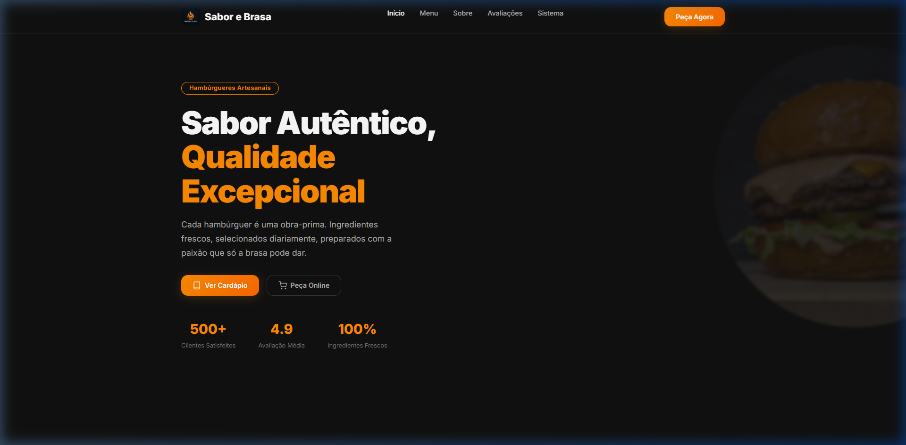
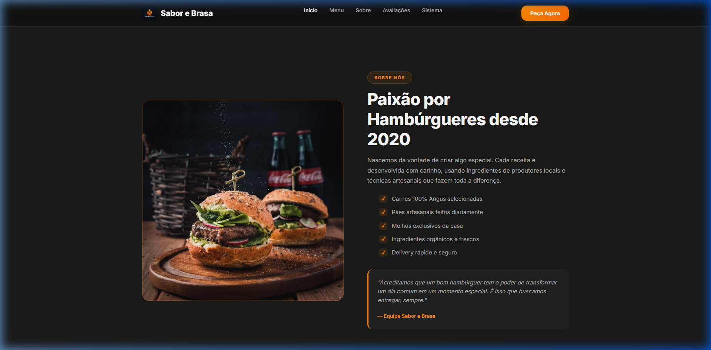
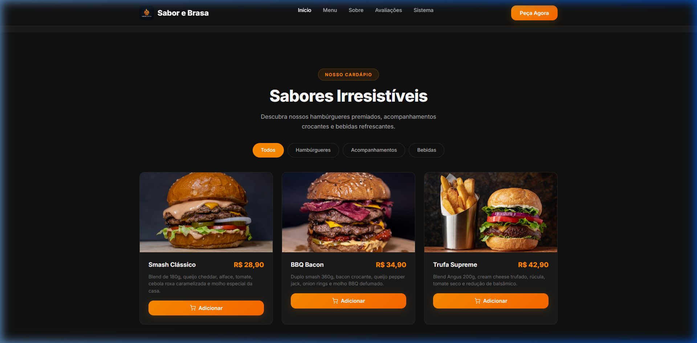
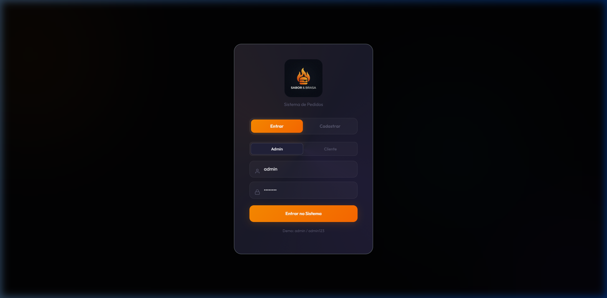
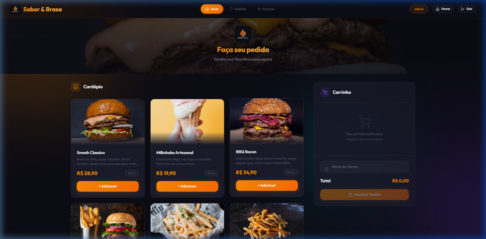
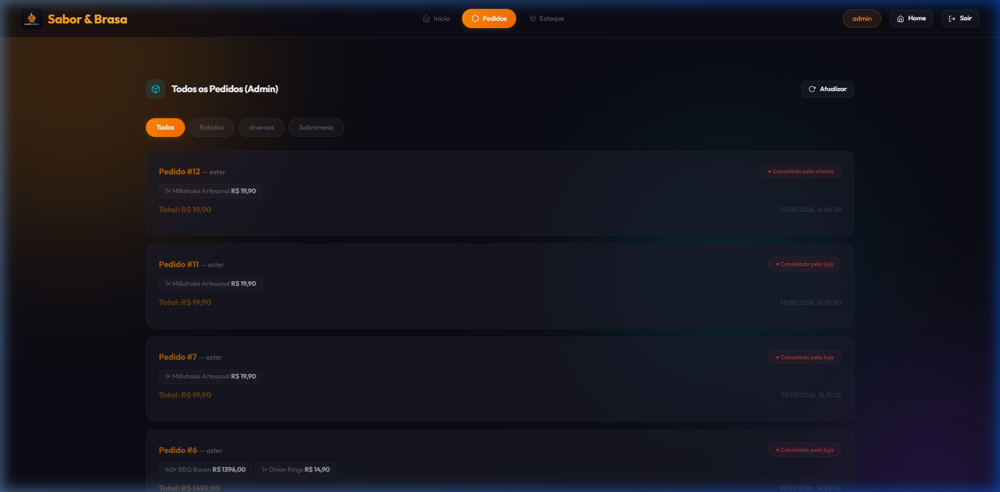
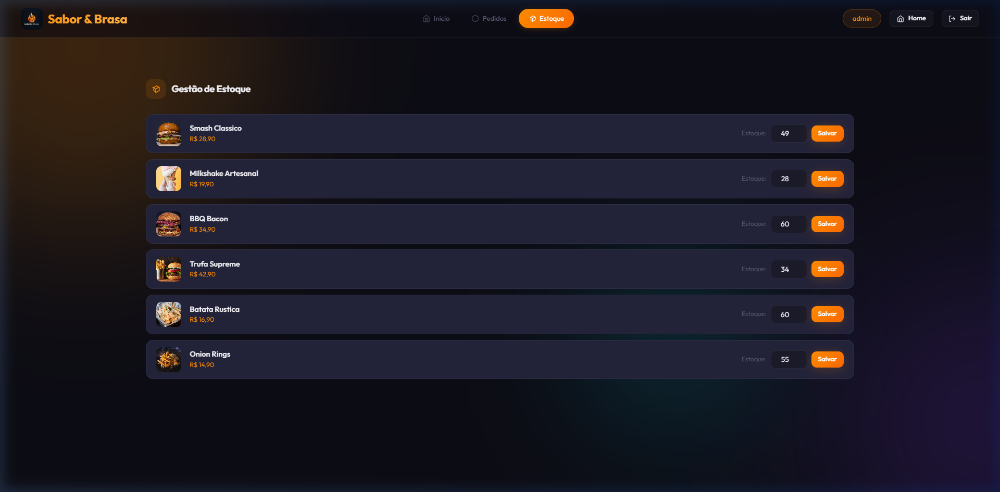

# 🔥 Sabor & Brasa — Sistema de Pedidos

<p align="center">
  
</p>

<p align="center">
  <strong>Sistema completo de gerenciamento de pedidos para restaurante</strong><br>
  Desenvolvido com .NET 10, Entity Framework Core, MySQL e frontend vanilla JS
</p>

<p align="center">
  
  
  
  
  
</p>

---

## 📸 Screenshots

### 🏠 Home — Landing Page


### 🏠 Home — Sobre Nós


### 🏠 Home — Cardápio


### 🔐 Tela de Login


### 👑 Painel Admin — Início (Cardápio + Carrinho)


### 👑 Painel Admin — Todos os Pedidos


### 👑 Painel Admin — Gestão de Estoque


---

## 🚀 Funcionalidades

### 🔐 Autenticação e Autorização
- **Login Admin** com usuário/senha
- **Cadastro e Login de Clientes** via email/senha
- **JWT (JSON Web Tokens)** com claims de `Role` e `ClienteId`
- **Hash de senhas** com BCrypt
- Diferenciação visual de perfis (badge verde para cliente, laranja para admin)

### 🍔 Cardápio e Carrinho
- Exibição de produtos com imagens, descrições, preços e estoque disponível
- Carrinho interativo com adição/remoção de itens
- Validação de estoque em tempo real
- Botão "Esgotado" automático quando estoque = 0

### 📦 Sistema de Pedidos
- Criação de pedidos com múltiplos itens
- **QR Code Pix** gerado automaticamente para pagamento
- Cancelamento de pedidos com restauração automática de estoque
- **Isolamento de dados**: cliente vê apenas seus próprios pedidos
- **Filtro por categoria**: Bebidas, Lanches, Sobremesas, etc.

### 👑 Painel Administrativo
- **Navbar unificada** com abas: Início, Pedidos, Estoque
- **Visão global**: admin vê todos os pedidos de todos os clientes
- **Gestão de estoque**: atualização de quantidades por produto
- **Cancelamento com rastreio**: pedidos cancelados pelo admin aparecem como *"Cancelado pela loja"* para o cliente

### 🔄 Cancelamento Inteligente
| Quem cancela | Status exibido |
|:---|:---|
| **Admin** | `Cancelado pela loja` |
| **Cliente** | `Cancelado pelo cliente` |

- O pedido **não é deletado** — permanece visível com status em vermelho
- O estoque é **restaurado automaticamente**
- Botões de ação são **ocultados** em pedidos cancelados

---

## 🏗️ Arquitetura

```
SistemaProdutos-1/
├── Api/
│   ├── Controllers/         # AuthController, PedidoController, ProdutoController, CategoriasController
│   ├── Context/             # AppDbContext (EF Core)
│   ├── DTOs/                # Data Transfer Objects
│   ├── Extensions/          # Extension methods
│   ├── Filters/             # Action Filters
│   ├── Migrations/          # EF Core Migrations
│   ├── Models/              # Entidades: Produto, Pedido, ItemPedido, Categoria, Cliente
│   ├── Repositories/        # Repository Pattern + Unit of Work
│   ├── Services/            # PedidoService (business logic)
│   ├── wwwroot/
│   │   ├── css/styles.css   # Design system completo
│   │   ├── js/app.js        # Frontend SPA (vanilla JS)
│   │   ├── img/             # Logo e assets
│   │   └── pedidos.html     # Página principal
│   ├── Program.cs           # Configuração e middleware
│   └── appsettings.json     # ConnectionString, JWT config
└── docs/screenshots/        # Screenshots da aplicação
```

### Padrões Utilizados
- **Repository Pattern** — abstração da camada de dados
- **Unit of Work** — controle transacional centralizado
- **Service Layer** — lógica de negócio isolada dos controllers
- **DTOs** — separação entre modelos de domínio e contratos da API
- **JWT Bearer Authentication** — autenticação stateless

---

## 🛠️ Tecnologias

| Camada | Tecnologia |
|:---|:---|
| **Backend** | .NET 10, ASP.NET Core Web API |
| **ORM** | Entity Framework Core 10 |
| **Banco de Dados** | MySQL 8.0 |
| **Autenticação** | JWT Bearer + BCrypt.Net |
| **QR Code** | QRCoder (Pix payload) |
| **Frontend** | HTML5, CSS3 (vanilla), JavaScript (ES6+) |
| **UI Framework** | Bootstrap 5.3 (base) |
| **Tipografia** | Google Fonts — Outfit |
| **Documentação API** | Swagger / Swashbuckle |

---

## ⚙️ Pré-requisitos

- [.NET 10 SDK](https://dotnet.microsoft.com/download/dotnet/10.0)
- [MySQL 8.0+](https://dev.mysql.com/downloads/)
- [EF Core CLI Tools](https://learn.microsoft.com/ef/core/cli/dotnet)

```bash
dotnet tool install --global dotnet-ef
```

---

## 🚀 Como Executar

### 1. Clone o repositório

```bash
git clone https://github.com/seu-usuario/SistemaProdutos-1.git
cd SistemaProdutos-1
```

### 2. Configure o banco de dados

Edite `Api/appsettings.json` com suas credenciais MySQL:

```json
{
  "ConnectionStrings": {
    "ConexaoPadrao": "Server=localhost; Database=CatalogoDB; user=root; Password=SUA_SENHA"
  }
}
```

### 3. Aplique as migrations

```bash
cd Api
dotnet ef database update
```

### 4. Execute a aplicação

```bash
dotnet run
```

A aplicação estará disponível em: **http://localhost:5010**

### 5. Acesse o sistema

| Perfil | Credenciais |
|:---|:---|
| **Admin** | `admin` / `admin123` |
| **Cliente** | Cadastre-se pela aba "Cadastrar" |

---

## 📡 Endpoints da API

### Autenticação
| Método | Rota | Descrição |
|:---|:---|:---|
| `POST` | `/api/Auth/login` | Login admin (usuário/senha) |
| `POST` | `/api/Auth/login/email` | Login cliente (email/senha) |
| `POST` | `/api/Auth/cadastro` | Cadastro de novo cliente |

### Pedidos (requer JWT)
| Método | Rota | Descrição |
|:---|:---|:---|
| `GET` | `/api/Pedido` | Lista pedidos (filtrado por role) |
| `GET` | `/api/Pedido?categoriaId=2` | Filtro por categoria |
| `GET` | `/api/Pedido/{id}` | Detalhes de um pedido |
| `POST` | `/api/Pedido` | Cria novo pedido |
| `DELETE` | `/api/Pedido/{id}` | Cancela pedido |

### Produtos (requer JWT)
| Método | Rota | Descrição |
|:---|:---|:---|
| `GET` | `/api/Produtos` | Lista todos os produtos |
| `GET` | `/api/Produtos/{id}` | Detalhes de um produto |
| `POST` | `/api/Produtos` | Cria produto |
| `PUT` | `/api/Produtos/{id}` | Atualiza produto |
| `DELETE` | `/api/Produtos/{id}` | Remove produto |
| `PATCH` | `/api/Produtos/{id}/estoque` | Atualiza estoque (Admin) |

### Categorias (requer JWT)
| Método | Rota | Descrição |
|:---|:---|:---|
| `GET` | `/api/Categorias` | Lista categorias |

---

## 🔒 Segurança

- Senhas hasheadas com **BCrypt** (salt automático)
- Tokens JWT com expiração configurável (padrão: 60 min)
- Claims de `Role` (Admin/Cliente) e `ClienteId` no token
- Endpoints protegidos com `[Authorize]`
- Estoque acessível apenas para `[Authorize(Roles = "Admin")]`
- Isolamento de dados: clientes não acessam pedidos de outros clientes

---

## 📄 Licença

Este projeto é de uso educacional e demonstrativo.

---

<p align="center">
  Feito por <strong>Estefany Gomes</strong>
</p>
